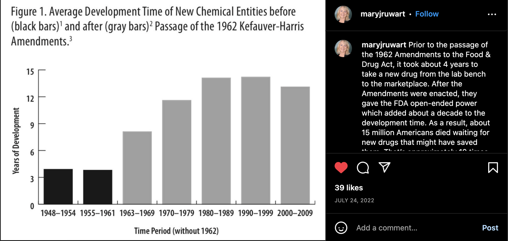

[Read & Think](/README.md) > *Healthcare*

# Healthcare

## Free-Market Healthcare
<cite>["What’s so bad about fee-for-service health care?"](https://thecannononline.com/whats-so-bad-about-fee-for-service-health-care/?utm_campaign=The%20Daily%20Cannon&utm_medium=email&_hsmi=201823420&_hsenc=p2ANqtz--0uhBePQ8lzF_ZpKYrWuEhU1z_0IXNO63yzuM6US57rZILvvGUBp0amZaUNHzOh10bT5pe3XmqLjqtx6zouTg100oiHw&utm_content=201823420), Jack Brown, January 2017</cite>
> The present health care system in the United States bears little resemblance to 1926. The once transparent, agreed-upon fees between patient and physician have all but disappeared. Today, payment is no longer agreed to by the patient and the physician. Payment is primarily negotiated between insurers and other payers and not available for patients to see. The rates are not determined by real world market forces, but by formula or by funding levels. Even worse, fees and payments are constrained by coding guidelines and rules such as CPT and ICD-10. Bureaucrats working for such government agencies as HCFA, COBRA, FDA, DHHS, Medicare, and Medicaid, etc. continue to replace freedom in medicine with complex and unintelligible statistical models attempting to determine the “true medical needs” of present and future generations of Americans (2), and the prices for them.
>
> Many health policy intellectuals have continually sounded the alarm that medicine suffers from “market failure,” and does not adhere to the same laws of economics as other sectors of our society. This is often accepted without question. It is believed that only through government intervention can health care become optimized to meet the needs of society. In 1963, Nobel Prize winner Kenneth Arrow reinforced this view when he wrote “Uncertainty and the Welfare Economics of Medical Care.” As time has shown, the problem with Arrow’s theory is that idealized competitive models don’t hold up well under real world conditions.
>
> As Milton Friedman put it simply, “The hardest thing in the world to understand is that people operating separately, through their joint relations with one another, through market transactions, can achieve a greater degree of efficiency and of output than can a single central planner.”

* Establish free-market healthcare: https://en.wikipedia.org/wiki/Free-market_healthcare
    * Health Care Providers: must disclose, display, and publish the prices for itemized services & procedures.
* Providers are encouraged to offer their own insurance, wellness packages, etc.
* The role of medical health insurance:
    * Preventative should be 80% - 100% covered
    * Critical Illness
    * Accidental
    * Cross-state plans*

***

## Reducing medical and drug costs

1. **Establish a transparent, fee-for-service price system** - All costs must be published for services to be provided. Healthcare providers can no longer arbitrarily bill months later (with or without insurance). Patients should be able to quickly and simply shop for procedures and prices.
2. **Reduce frivolous malpractice lawsuits** - Stop frivolous malpractice lawsuits, caps on rewards for “suffering and pain”
3. **Simplify and reduce FDA approval** - Reduce and simplify FDA testing requirements (shorten time frame) https://www.instagram.com/p/CgZqar8O_7L/?igshid=YmMyMTA2M2Y= 
4. **Minimize the role 3rd party payers** - reduce and simplify the way 3rd parties involved in healthcare.
5. **Eliminate [Drug Benefit Managers](https://en.wikipedia.org/wiki/Pharmacy_benefit_management) (DBMs / PBMs)** - eliminating the need for middlemen who control what and how much a drug costs. Elimination will increase competition and restore the market control, thus lowering the prices.
6. **Streamline education path to medical careers** - increase supply of medical care providers and (i.e. doctors).
7. **Repeal of the [Affordable Healthcare Act 2012](https://en.wikipedia.org/wiki/Affordable_Care_Act) (i.e. Obamacare)** - In order for free-market to operate, the federal government and it's onerous control and overregulation of how it is paid for needs to be removed.